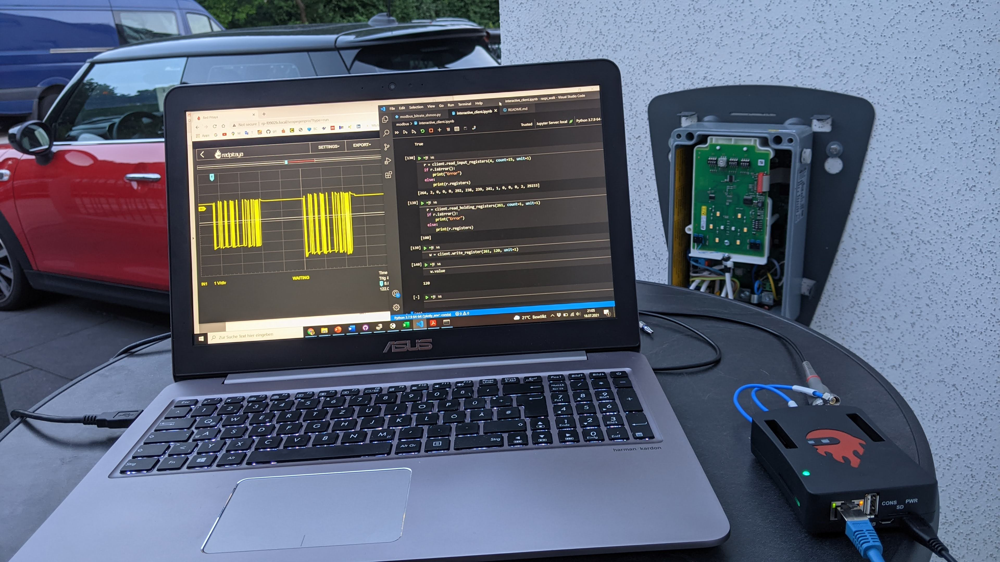
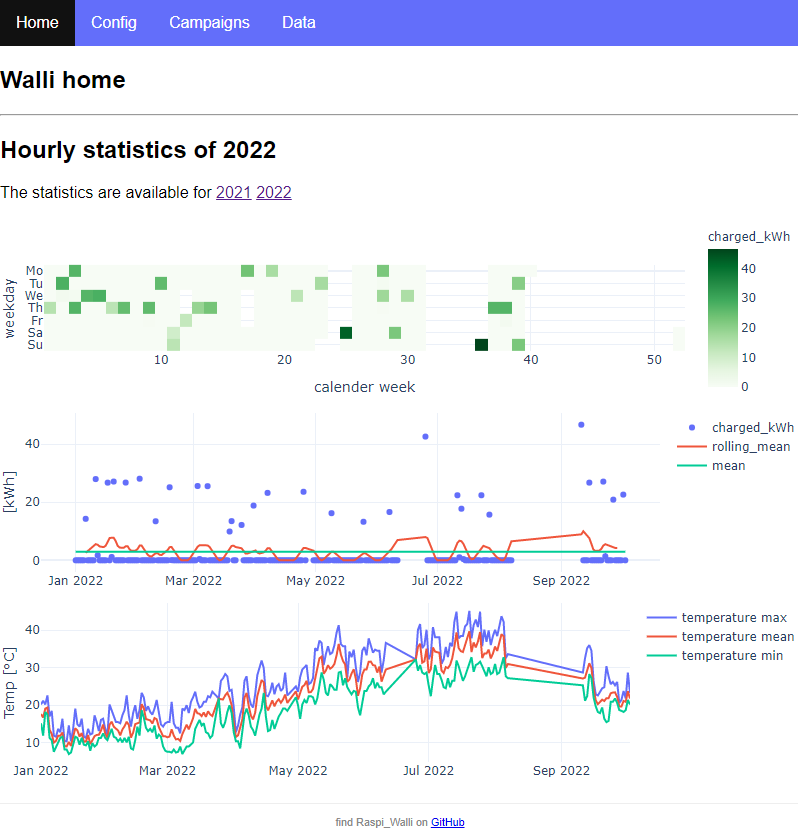
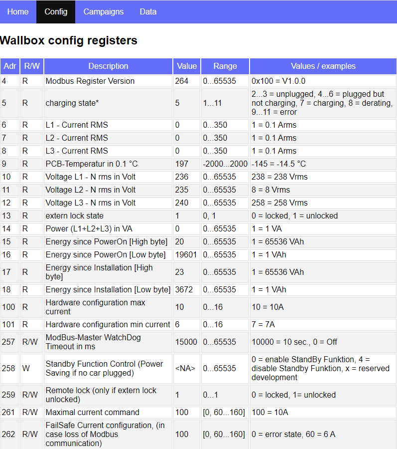
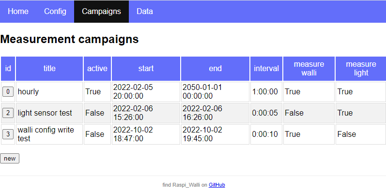
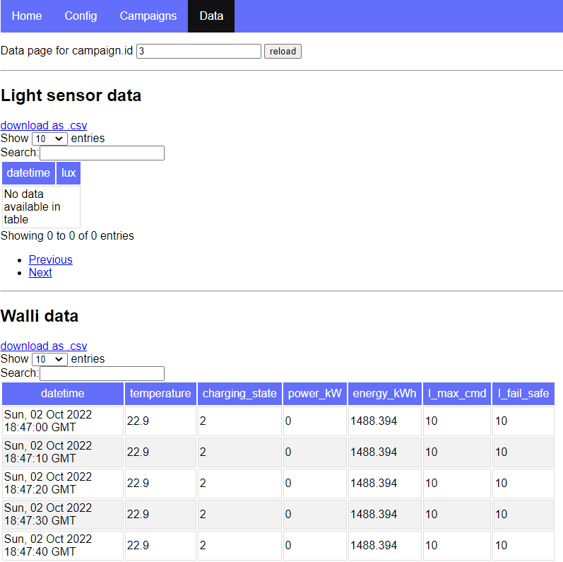
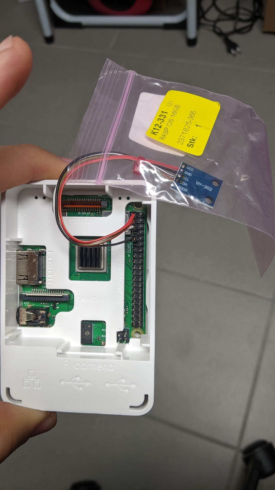
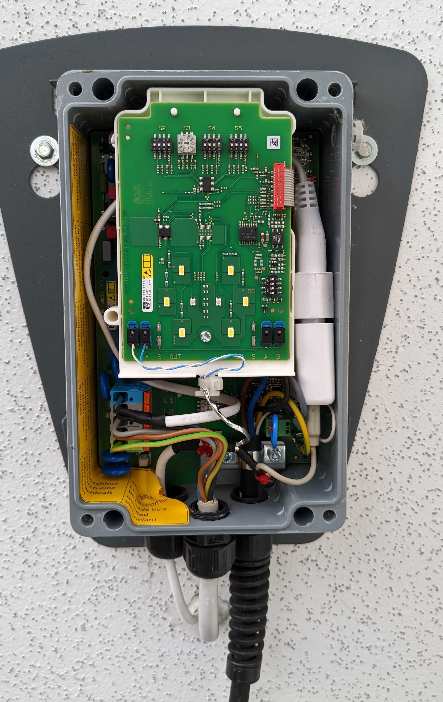
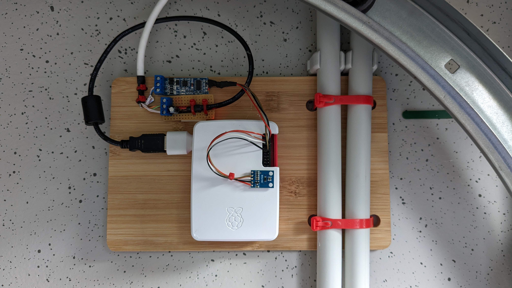
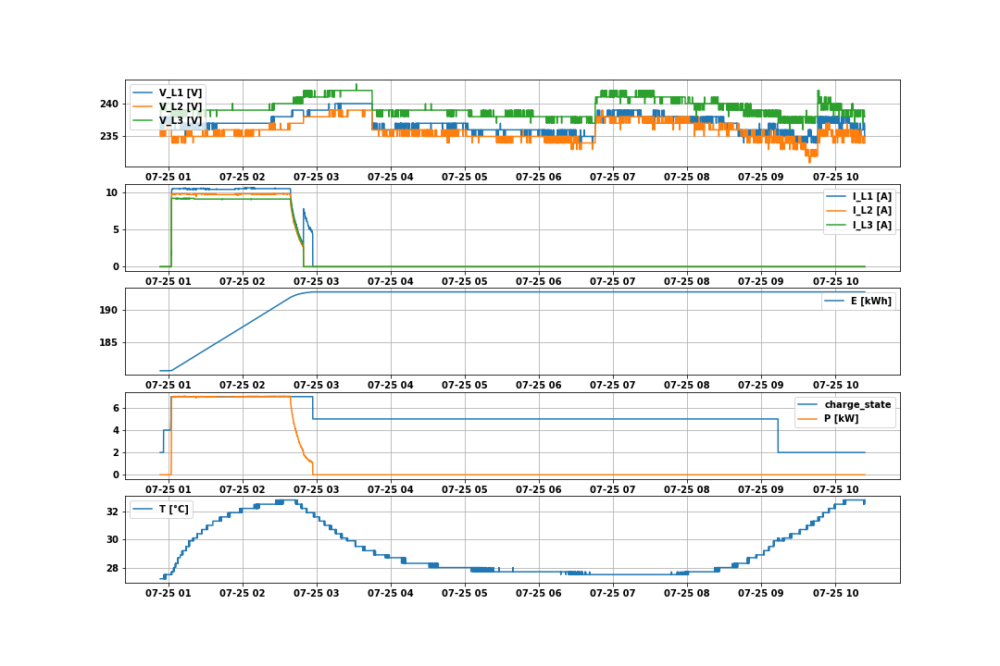

__`! OUT OF DATE WARNING !`__ This project is no longer in use. The job is done by the successor project __[raspi_walli_mqtt with home assistant](https://github.com/munich-ml/raspi_walli_mqtt)__.

# Heidelberger Wallbox control
The main objective of this project is to control and monitor a **Heidelbert Wallbox Energy Control** with a **Raspberry Pi**.  

# ModBus RS485
Raspberry Pi controlls the Heidelberger wallbox via **Modbus RTU**. There is a **modbus** folder dedicated to the topic. **RTU** stands for *Remote Terminal Unit* and is serial communication over RS485 (or even RS232) in contrast to **Modbus TCP** over Ethernet.

## General Modbus info resources
- [Modbus 101 - Introduction to Modbus](https://www.csimn.com/CSI_pages/Modbus101.html)
- [Youtube video](https://www.youtube.com/watch?v=yRpWjjRNE-c) showing Modbus RTU communication from a Raspberry Pi Koyo DL06 PLC

## PyModbus simple rtu server and client
[PyModbus](https://pymodbus.readthedocs.io/) is a Python package that implements the Modbus protocol stack. A simple Modbus server and client have been implemented:
- [modbus/simple_modbus_rtu_server.ipynb](modbus/simple_modbus_rtu_server.ipynb)
- [modbus/simple_modbus_rtu_client.ipynb](modbus/simple_modbus_rtu_client.ipynb)

The server and client have successfully been tested with [com0com Null Modem Emulator](http://com0com.sourceforge.net/) as well as with two USB-RS485 sticks and a loop cable. 

## How to make the Heidelberg Wallbox Energy Control respond
It took me quite some trial-and-error, to get the communication running. In summary, the following items need to be configured:
- ``Follower``: If the wallbox is configured as ``Leader``, it sends out reads but doesn't respond. Thus, the wallbox must be configured as ``Follower``.
- ``Bus-ID`` must be 1..15, not 0. By default, the ``Bus-ID`` is 0 and its ``Follower``. Apparantly, that combination puts the wallbox in some kind of stand-alone mode. 
- Set ``holding_register 261`` to the desired current limit. Otherwise ``262`` shows ``error state``. The current limt can't be set higher than the hardware switch current. 
- Disable the Standby function by writing at ``4`` to the ``holding_register 258``. Otherwise the wallbox stops responding after about 12 minutes.  

The notebook [modbus/read_from_walli.ipynb](modbus/read_from_walli.ipynb) demonstrates successful communication and this is how it looks like

# Flask app
The actual (productive) application is implemented using [Flask](https://flask.palletsprojects.com/) in the **flask** folder. This is how it look:

The top-level block diagram looks like this:

## Mutli-threading
The **raspi_walli** webserver project requires concurrent operations. It need to serve the Webpage and do sensor polling (e.g. the wallbox) at the same time. I considered two libraries for this task:
- **`threading`**, Pythons stardard concurrency library with **preemptive scheduling**, meaning the os pauses a thread at any time, putting its state on the stack and continuous with another thread.
- **`asyncio`**, the modern library with **cooperative scheduling**. Each thread is assumed to be cooperative, meaning each thread gives back the CPU voluntarily, reducing the task switching overhead.

Here is a nice article comparing the two approaches: [Concurrency in Python: Cooperative vs Preemptive Scheduling](https://medium.com/fullstackai/concurrency-in-python-cooperative-vs-preemptive-scheduling-5feaed7f6e53)

I chosed to use the old-fashioned `threading` because `asyncio` isn't fully supported by `Flask`, at least as of December 2021.

## Light sensor
A BH1750 light sensor is connected and can be captured in the flask app. However, no evaluation is implemented, yet (ToDo).

## Installation
The wallbox connections including USB-power-supply (right side) and modbus-RS485 wires (white-blue twisted-pair):

The Raspberry-pi is mounded on the opposite side of the wall, inside the garage. Both power (5V USB) and data (RS-485) are routed on one CAT-5 calbe.

## Data evaluation
Evaluation preview:

Data evaluation is conducted within the Jupyter Notebook [eval-Mini.ipynb](eval/eval-Mini.ipynb). A comparison with measurements from inside the BMW Mini shows very good correlation.

# ToDos
Potential improvements
- Make the website more reactive, probably using **Ajax** and **JavaScript**. So far, wallbox reads are started from the flask view function and paused (using threading.Event) until the wallbox answers. The wait time isn't too bad, though.
- Use BH1750 light sensor to implement a **Garage left open detector** an send a warning E-mail.
- Beautifying the website using **Bootstrap**. So far, I couldn't get bootstrap running.
- Move to a **production server**. Currently, the flask development server is used.
- Serve to the Internet. Currently, the server can be reached at the lokal host, only.
