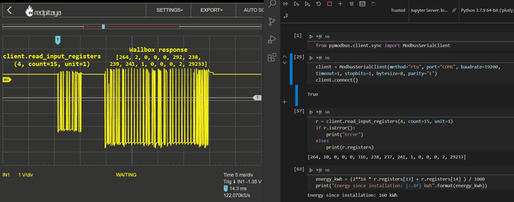

# Modbus
Within this project, a Raspberry Pi will be connected to a **Heidelbert Wallbox Energy Control** via **Modbus RTU**. Here is how the wallbox looks like: 

Thus, this folder is dedicated to the **Modbus RTU**. **RTU** stands for *Remote Terminal Unit* and is serial communication over RS485 (or even RS232) in contrast to **Modbus TCP** over Ethernet.

## General Modbus info resources
- [Modbus 101 - Introduction to Modbus](https://www.csimn.com/CSI_pages/Modbus101.html)
- [Youtube video](https://www.youtube.com/watch?v=yRpWjjRNE-c) showing Modbus RTU communication from a Raspberry Pi Koyo DL06 PLC

## PyModbus simple rtu server and client
[PyModbus](https://pymodbus.readthedocs.io/) is a Python package that implements the Modbus protocol stack. A simple Modbus server and client have been implemented:
- [simple_modbus_rtu_server.ipynb](simple_modbus_rtu_server.ipynb)
- [simple_modbus_rtu_client.ipynb](simple_modbus_rtu_client.ipynb)

The server and client have successfully been tested with [com0com Null Modem Emulator](http://com0com.sourceforge.net/) as well as with two USB-RS485 sticks and a loop cable. 

## How to make the Heidelberg Wallbox Energy Control respond
It took me quite some trial-and-error, to get the communication running. In summary, the following items need to be configured:
- ``Follower``: If the wallbox is configured as ``Leader``, it sends out reads but doesn't respond. Thus, the wallbox must be configured as ``Follower``.
- ``Bus-ID`` must be 1..15, not 0. By default, the ``Bus-ID`` is 0 and its ``Follower``. Apparantly, that combination puts the wallbox in some kind of stand-alone mode. 
- Set ``holding_registers`` 261, 262 to the desired current limit. Otherwise, 262 is set to 0, meaning ``error state``. The current limt can't be set higher than the hardware switch current. 

The notebook [read_from_walli.ipynb](read_from_walli.ipynb) demonstrates successful communication and this is how it looks like

