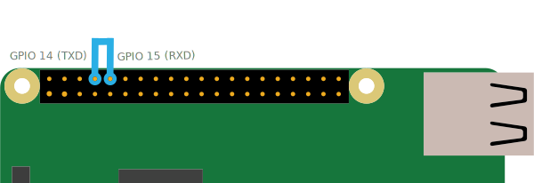

# Basic Raspi UART Test
This folder contains docs and scripts to get the serial port running on the Raspberry Pi.

## 1. Enable the serial port
In oder to enable the serial port on your Raspberry Pi follow the instructions given [here](https://www.raspberrypi.org/documentation/configuration/uart.md).

## 2. Hardware loopback Tx-->Rx


## 3. Do communication test
Testscript [serial_loopback_test.py](https://github.com/munich-ml/raspi_walli/blob/main/raspi_uart/serial_loopback_test.py)

# Allocate serial0 to ttyAMA0
By default, `serial1` is allocated to ttyS0, which is less permormant that `serial0` which is by default allocated to bluetooth. To change this add `dtoverlay=pi3-disable-bt` to the `/boot/config.txt` configuration file and reboot the Raspi. Check the modification like this:
```Bash
pi@raspberrypi:~ $ ls -l /dev/seri*
lrwxrwxrwx 1 root root 7 Sep 12 11:09 /dev/serial0 -> ttyAMA0
lrwxrwxrwx 1 root root 5 Sep 12 11:09 /dev/serial1 -> ttyS0
```
